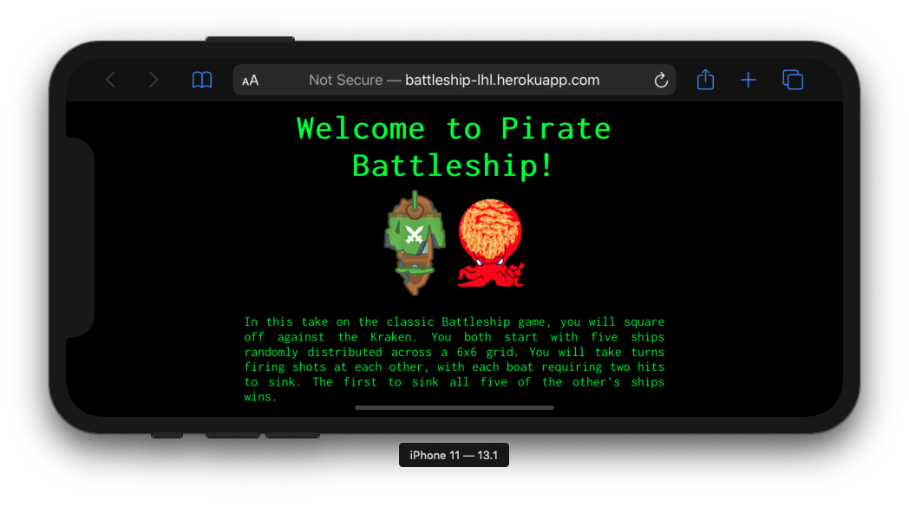
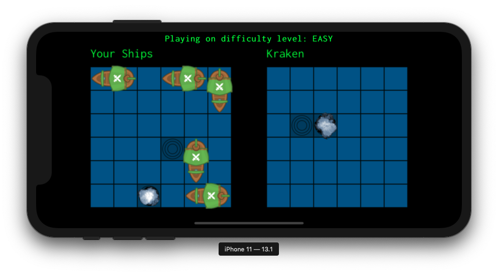
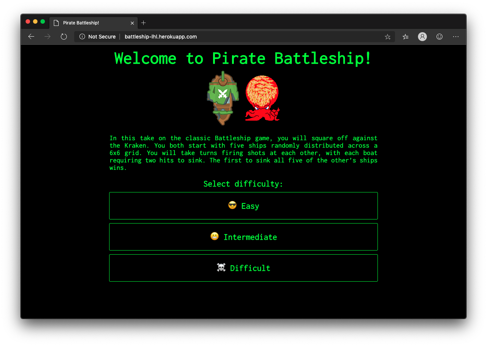
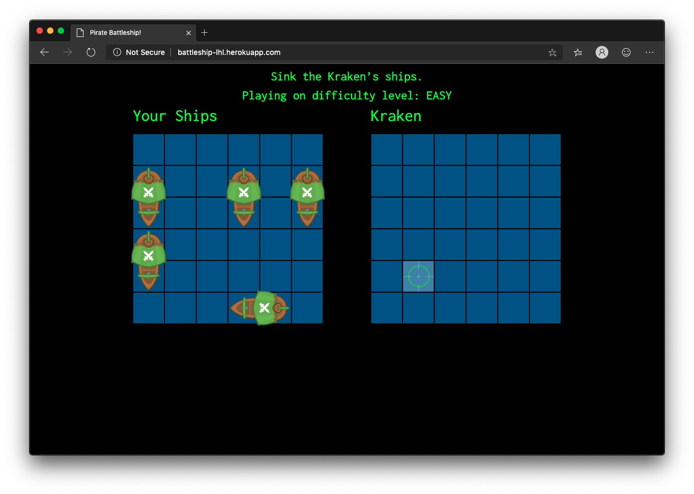
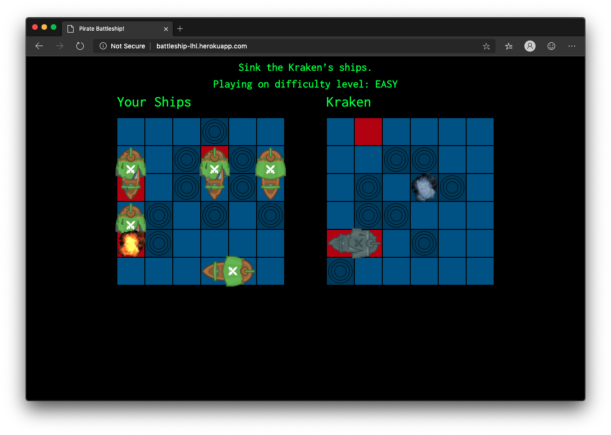
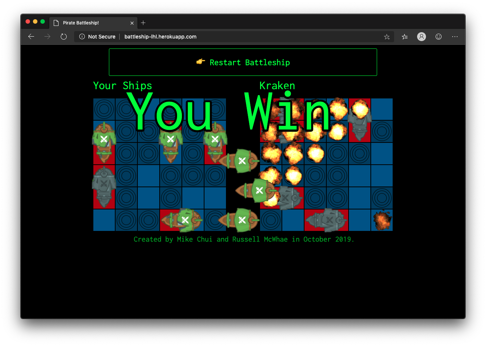

# Pirate Battleship!

[*—You sank my pirate ship.*](https://www.youtube.com/watch?v=GkwMDkfrZ1M)

## Final Product

Key features:
1) Play against the Kraken in this single-player Battleship clone
2) Three different difficulty levels, set according to a basic probabilistic hit algorithm.
3) Phaser 3/React front-end with socket-connected API server for Kraken shot logic.

### Mobile View

#### New Game


#### Playing a Game


### Desktop View

#### New Game


#### Game Board


#### Playing a Game


#### Victory



## Project Setup

### Dependencies

- node
- express
- nodemon *devDependencies*
- Phaser 3
- React

### Installation

1. Clone this repo (the “client” repo).

2. Clone the [battleship-server](https://github.com/mikel-k-khui/battleship-server) repo (the “server” repo).

3. Install node dependencies in **both** the server and client directories: `npm install`

4. Start the server using `npm run watch`. The server console should say `Listening on port 8001 in development mode.`
*Note: nodemon is used, so you should not have to restart this server*

5. Start the client: `npm run watch`. The default port is 8080.

6. Open a new browser window and enter the local host with your port.
```
http://localhost:8080/
```

7. Have fun blowing ships up! Press Q or E to see fiery explosions.

## Testing

* Manual console.logs
* React Developer Tools for Google Chrome

## Contributing

As this is a student project there is currently no process for submitting pull requests.

## Versioning

* [SemVer](http://semver.org/) for versioning: version 1.0.0.

## Authors

* [**Russell McWhae**](https://github.com/rmcwhae) - *Initial work*
* [**Michael Chui**](https://github.com/mikel-k-khui) - *Initial work*

## License

This project is licensed under the MIT License - see the [LICENSE.md](LICENSE.md) file for details

## Credits

* Pirate Ships assets from https://www.kenney.nl/assets/pirate-pack
* Kraken from https://opengameart.org/content/kraken
* Phaser 3 and React project boilerplate from https://github.com/photonstorm/phaser3-project-template